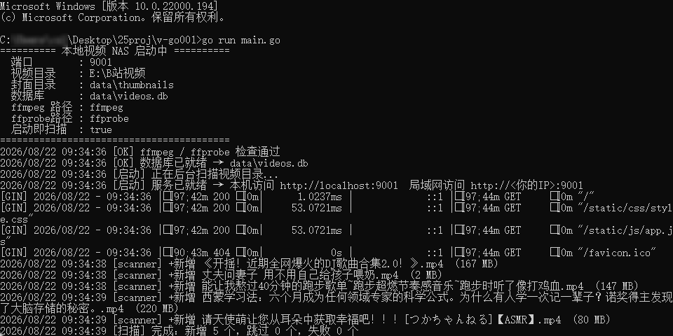

#  本地视频点播系统 · 使用说明

### 宗旨：为了不让硬盘里面的经典蒙尘，经典永流传
（项目运行挂着，手机美美看电影！！ 支持缩略图，range请求随意拖拽进度条，精美播放页面）
效果展示：
1 启动项目go run main.go
2 自动扫描目录下面所有视频，建立sqlite数据库，vedio表（data目录下的db文件），利用ffmepg截取缩略图（data下面）
3 下面就是可以点击播放了


# 使用方法：
1. config/config.go中配置端口，视频文件夹路径


一、目录里这些是干啥的
----------------------
main.go                  ← 程序入口
config/config.go         ← 想改端口、视频目录、ffmpeg 路径就改这个
internal/                ← 业务代码（DB、扫描、上传、页面渲染、路由）
static/css + static/js   ← 前端样式和脚本
templates/               ← HTML 页面
data/                    ← 运行后自动创建
 ├─ library/             ← 默认的视频根目录（把 mp4 丢这里会自动扫进去；可改 config）
 ├─ thumbnails/          ← 封面缩略图
 └─ videos.db            ← SQLite 数据库（删了就等于清空记录）


二、启动前需要装两样东西
------------------------

★ 1) Go 语言环境（至少 1.21）
     去 https://golang.google.cn/dl/ 下载 Windows 的 msi，
     双击安装即可。装好后开个新的 cmd 或 PowerShell，
     输入 "go version" 能看到版本号就 OK。

★ 2) GCC（因为 SQLite 驱动依赖 C 编译）
     Windows 推荐装 TDM-GCC：
     https://jmeubank.github.io/tdm-gcc/
     下载 tdm64-gcc 那个 exe，一路 Next 安装即可。
     装好输入 "gcc --version" 能看到版本号就 OK。

   （不想装 TDM-GCC，装 MinGW-w64 也行，只要能在 cmd 里
    输 gcc 能找到就行。）

★ 3) FFmpeg（截封面 + 读时长/分辨率）
     下载地址：https://www.gyan.dev/ffmpeg/builds/
     选 "release essentials" 的 zip，解压后把 bin 目录
     （里面有 ffmpeg.exe 和 ffprobe.exe）加到系统 PATH。
     加完开新 cmd 输入 "ffmpeg -version" 能看到版本就 OK。

     如果不想加 PATH，也可以把解压路径直接写到
     config/config.go 里的 FFmpegPath / FFprobePath，例如：
         FFmpegPath:  "C:/tools/ffmpeg/bin/ffmpeg.exe",
         FFprobePath: "C:/tools/ffmpeg/bin/ffprobe.exe",
    
     【没装 FFmpeg 也能启动】只是没封面、没时长、没分辨率，
     不影响浏览和播放；之后装好重启程序即可。


三、启动程序
------------
在项目目录（v-go001 那个文件夹）打开 cmd 或 PowerShell：

    go mod tidy          ← 第一次需要，下载依赖；之后不用
    go run main.go       ← 直接跑起来（开发调试用）
    
    或者打包成 exe：
    go build -o video-nas.exe main.go
    然后双击 video-nas.exe 启动。

启动成功会看到类似：
    ========== 本地视频 NAS 启动中 ==========
      端口        : 8080
      视频目录    : ./data/library
      ...
    [启动] 服务已就绪 → 本机访问 http://localhost:8080

然后浏览器打开 http://localhost:8080 就能用啦。


四、局域网内其他设备访问
------------------------
先在命令行里查一下你电脑的局域网 IP（一般是 192.168.x.x）：
    ipconfig → 找到「IPv4 地址」那一行。

手机、平板、电视连同一个 WiFi，浏览器打开：
    http://你的IP:8080

如果打不开，大概率是 Windows 防火墙拦截了。解决：
  ① 控制面板 → Windows Defender 防火墙 → 允许应用通过防火墙
  ② 找到 "video-nas.exe" 或 "go"，把「专用网络」打勾确定。
  或者第一次启动弹窗时点「允许访问」。


五、常见问题
------------
Q: 我想把视频放在 D:/电影 而不是 data/library，怎么改？
A: 打开 config/config.go，修改 VideoRoot 为 "D:/电影" 即可，重启生效。

Q: 扫描后发现视频信息不对，想重新扫一遍？
A: 网页右上角点「重新扫描」按钮。注意：同路径文件不会重复入库，
   数据库按 file_path 做了唯一键。

Q: 我不想要某条记录了，怎么删？
A: 进入播放页，右下角有「删除记录」按钮。
   · 如果视频是通过网页上传的 → 原文件会一起删掉
   · 如果视频是扫描从电影库里导入的 → 只删数据库记录，不动你的原文件

Q: 备份数据怎么办？
A: 直接把 data/ 文件夹整个复制走就可以，里面 db + 封面都有。
   真正的视频本体在 config 指定的目录，备份时别忘了一起。

Q: 页面打开是白屏 / 报错？
A: 先看命令行窗口里的红色错误日志，最常见几类：
   · 找不到 ffmpeg：按第三节装 ffmpeg
   · gcc 相关报错：按第三节装 TDM-GCC
   · 端口被占用：改 config 里的 Port 为别的数

Q: 播放某视频只有声音没有画面？
A: 大概率是视频编码格式浏览器不支持（比如 HEVC / H.265 的 mp4 很多浏览器默认不硬解）。
   解决：用别的播放器下载下来看，或者转码成 H.264。


补充常用运维命令：

go打包
go build -o main.exe main.go

pm2运维

```
pm2 start ecosystem.config.js
# 启动
pm2 status # 查看进程状态
pm2 logs myapp # 查看日志
pm2 restart myapp # 重启进程
pm2 stop myapp # 停止进程
pm2 delete myapp # 删除进程

pm2 save          # 保存当前运行的进程列表（生成 dump.pm2）
pm2 resurrect     # 恢复保存的进程（对应脚本里的命令）
pm2 list          # 查看当前所有 PM2 进程
pm2 kill          # 停止所有 PM2 进程（包括守护进程）

# 正确的首次使用流程：
pm2 start ecosystem.config.js   # 启动应用
pm2 save                          # 保存进程列表
# 然后再把 .bat 脚本加入开机启动
```

ecosystem.config.js内容

```
module.exports = {
  apps: [{
    name: 'VidNest',                  // 修改为你的项目名 VidNest
    cwd: 'E:/prj/v-go001',            // 项目根目录，使用正斜杠
    script: 'main.exe',               // Go编译输出二进制，不是main.go
    out_file: 'D:/logs/out.log',
    error_file: 'D:/logs/error.log',
    autorestart: true,
    watch: false,
    instances: 1,
    env: {
    }
  }]
}
```

```
打包后需要的必要运行文件：（其他的都可以删了）
video-nas.exe     ← go后端
templates/        ← 这些 HTML 文件必须跟着 exe 走
  home.html
  folder.html
  player.html
  upload.html
  error.html
static/
  css/style.css
  js/app.js
data/             ← 运行时自动生成（数据库、视频、封面）
```